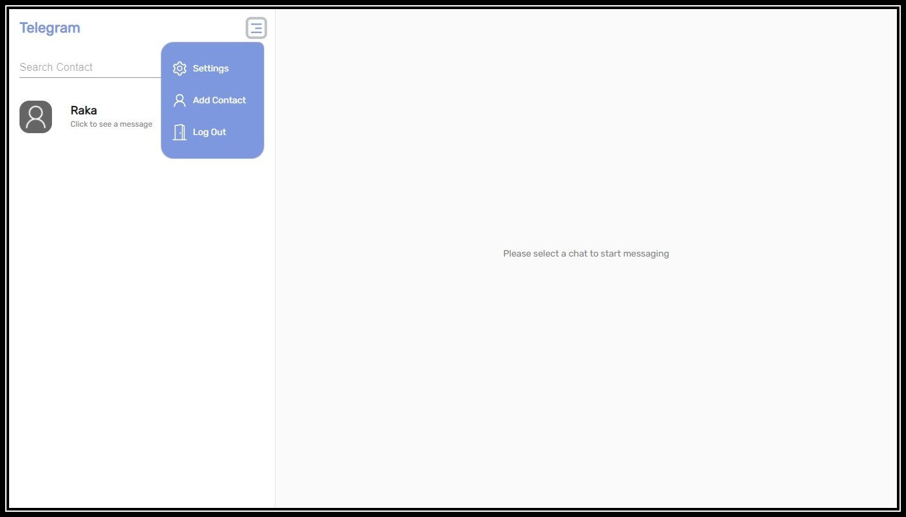

<div id="top"></div>

<!-- PROJECT LOGO -->
<br />
<div align="center">
  <a href="https://github.com/figoysra/Tellegram-App.git">
  </a>

<h3 align="center">TELEGRAM APP</h3>

  <p align="center">
    React JS TELEGRAM Realtime App
    <br />
    <a href="https://github.com/figoysra/TellegramApp-Repo"><strong>Explore API »</strong></a>
    <br />
    ·
    <a href="https://github.com/figoysra/Tellegram-App/issues">Report Bug</a>
    ·
    <a href="https://github.com/figoysra/Tellegram-App/issues">Request Feature</a>
  </p>
</div>


<!-- TABLE OF CONTENTS -->
<details>
  <summary>Table of Contents</summary>
  <ol>
    <li>
      <a href="#about-the-project">About The Project</a>
      <ul>
        <li><a href="#built-with">Built With</a></li>
      </ul>
    </li>
    <li>
      <a href="#getting-started">Getting Started</a>
      <ul>
        <li><a href="#installation">Installation</a></li>
      </ul>
    </li>
    <li><a href="#screenshot">Screenshot</a></li>
    <li><a href="#contact">Contact</a></li>
  </ol>
</details>


<!-- ABOUT THE PROJECT -->
## About The Project



Telegram app is a realtime chat app built using react for front end and express js, socket io, MYSQL for backend. The application can send messages to fellow contacts, delete messages and update the profile of the user.


<p align="right">(<a href="#top">back to top</a>)</p>


### Built With

* [React.js](https://reactjs.org/)
* [Redux](https://redux.js.org/)
* [Reactstrap](https://reactstrap.github.io/)
* [Bootstrap](https://getbootstrap.com/)
* [MUI](https://mui.com/)
* [Axios](https://www.npmjs.com/package/axios)
* [Socket io](https://socket.io/)


<p align="right">(<a href="#top">back to top</a>)</p>


<!-- GETTING STARTED -->
## Getting Started

**Login as Raka** </br>
Email : raka@email.com </br>
Password : 12345 </br>

**Login as User** </br>
Email : user@email.com </br>
Password : 12345


### Installation

1. Clone the repo
   ```sh
   git clone https://github.com/figoysra/week20.git
   ```
2. Install NPM packages
   ```sh
   npm install
   ```
3. Start the Application
   ```js
   npm start;
   ```

<p align="right">(<a href="#top">back to top</a>)</p>


<!-- ROADMAP -->
## Screenshot


Main View       |  Main View when Click User
:-------------------------:|:-------------------------:
  |  

Edit Profile         |  Delete Message
:-------------------------:|:-------------------------:
  |  


<p align="right">(<a href="#top">back to top</a>)</p>


<!-- CONTACT -->
## Contact

Figo Yusra  - [@instagram](https://www.instagram.com/figoyusra/) - figoyusra.133@gmail.com


<p align="right">(<a href="#top">back to top</a>)</p>

